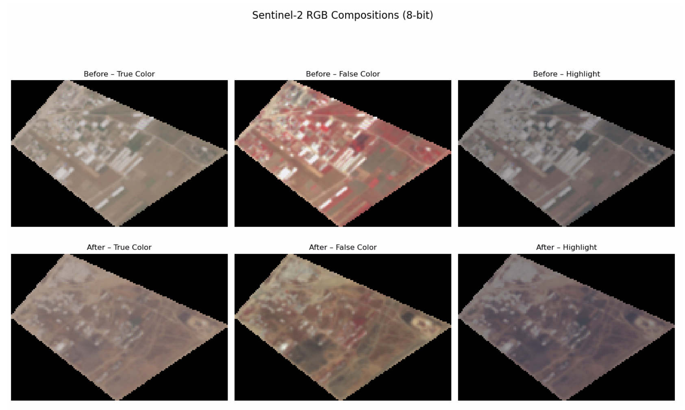
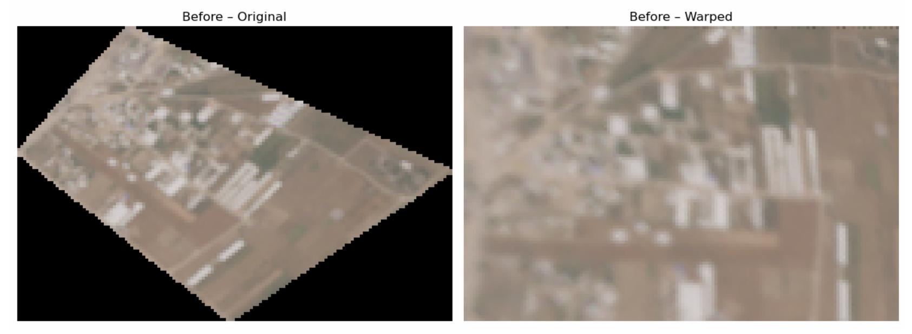
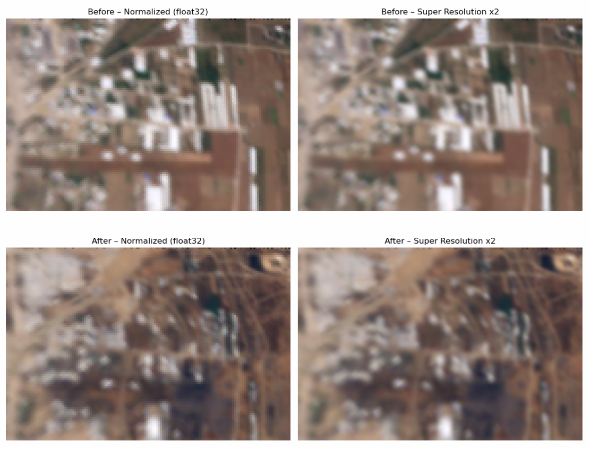
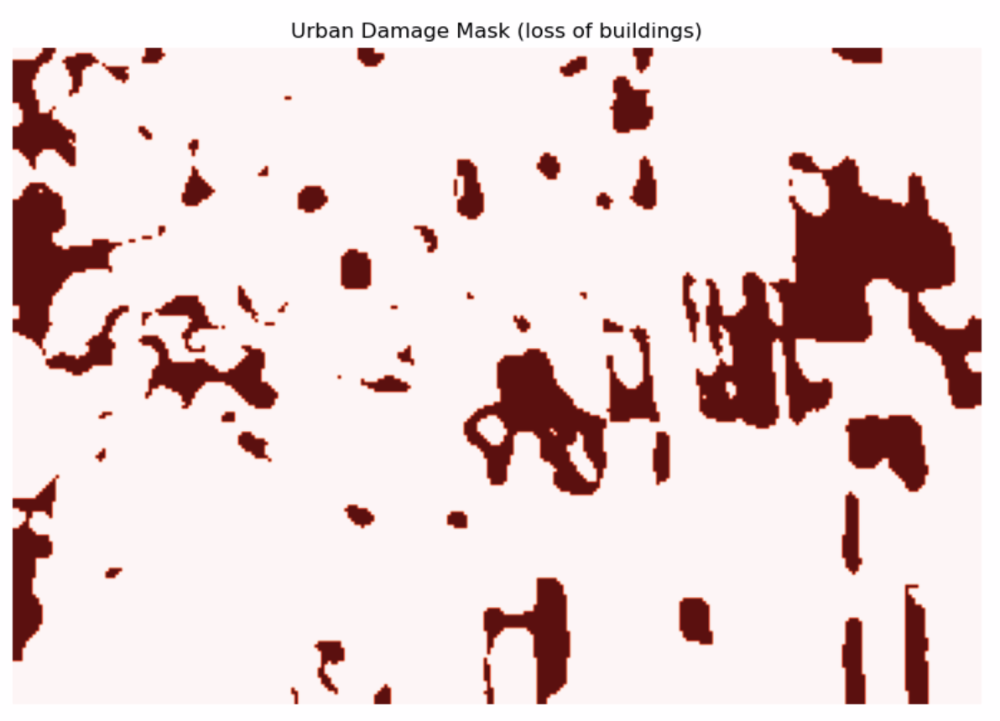
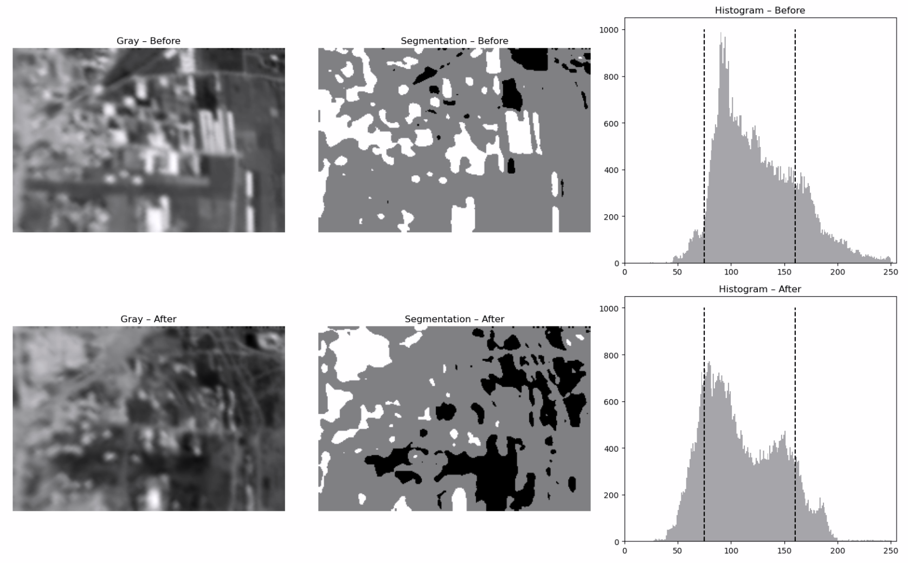
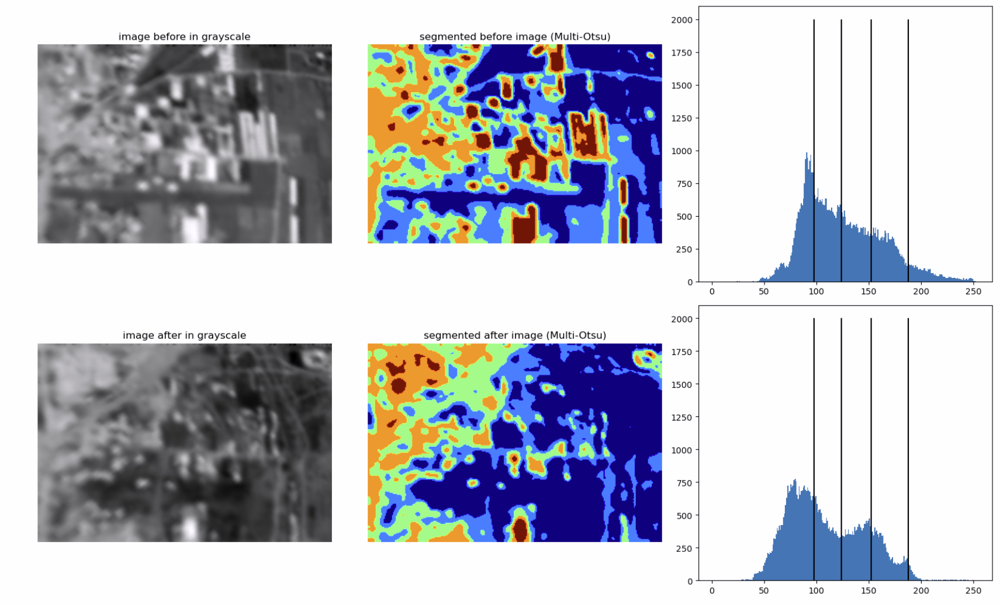
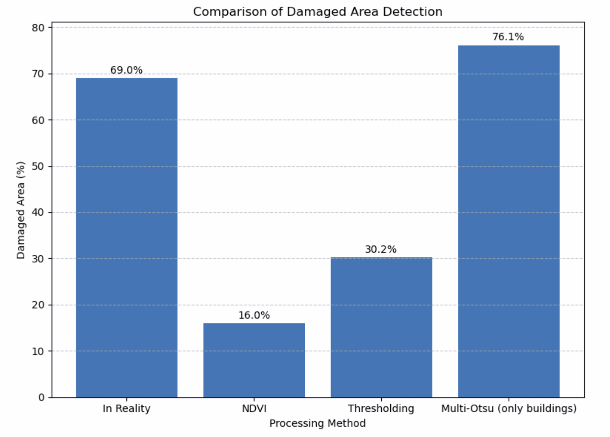

# Sentinel-2 Damage Detection & Urban Analysis Pipeline

A Python-based Jupyter Notebook pipeline for the acquisition, preprocessing, analysis, and visualisation of Sentinel-2 satellite imagery to detect urban areas, calculate urban indicators (modified NDVI), and identify damage in built environments. The detection methods used are NDVI, Thresholding, and Multi-Otsu thresholding.

---

## 📚 Table of Contents

* [Features](#-features)
* [Getting Started](#-getting-started)

  * [Prerequisites](#prerequisites)
  * [Installation](#installation)
* [Usage](#-usage)

  * [1. Import Sentinel-2 Images](#1-import-sentinel​-2-images)
  * [2. RGB Composite Visualization](#2-composite-visualization)
  * [3. Geometric Alignment](#3-geometric-alignment)
  * [4. Super-Resolution & Normalization](#4-super​-resolution--normalization)
  * [5. Urban Area Detection & NDVI Analysis](#5-urban-area-detection--ndvi-analysis)
  * [6. Grayscale Thresholding](#6-grayscale-thresholding)
  * [7. Multi-Otsu](#6-multi-otsu)
* [Results](#-results)
* [Project Structure](#project-structure)
* [License](#license)
* [Contact](#contact)

---

## 🚀 Features

* **Sentinel-2 Image Ingestion**: Load and mosaic multiple Sentinel-2 tiles.
* **Visualization**: Generate 8-bit RGB composites to quickly assess scene context.
* **Geometric Alignment**: Apply projective transforms to align multi-temporal scenes.
* **Super-Resolution & Normalization**: Enhance image quality and normalize reflectance values.
* **Urban Area Segmentation**: Identify built-up regions using simple thresholding or machine-learning masks.
* **Urban Index (NDVI)**: Compute and visualize NDVI to assess destruction of urban areas before/after.
* **Damage Detection**:

  * **RGB-Based Grayscale Segmentation**: Quick damage mask via intensity thresholds.
  * **Advanced Multi-Otsu Segmentation**: Refined building-level damage classification.

---

## 🛠 Getting Started

### Prerequisites

* Python 3.8+
* `os`, `glob`, `skimage`, `numpy`, `matplotlib`

You can install all dependencies with:

```bash
pip install -r requirements.txt
```

*(If you don’t have a `requirements.txt`, simply run `pip install rasterio numpy scikit-image matplotlib opencv-python`)*

---

## 💻 Usage

Open the notebook:

```bash
jupyter lab Project.ipynb
```

Follow the sections in order:

### 1. Import Sentinel-2 Images

Load your Sentinel-2 band TIFFs (e.g. B04, B03, B02) and stack them into a multiband array.

### 2. Composite Visualization



### 3. Geometric Alignment

Align pre- and post-event scenes using projective transformation:

```python
aligned = apply_projective(image)
```



### 4. Super-Resolution & Normalization

Upscale imagery and normalize reflectance values:

```python
def apply_super_resolution(image, scale_factor=2):
...
def normalize_image(image):
...
```



### 5. Urban Area Detection & NDVI Analysis

Segment built-up areas and compute NDVI:

```python
def compute_ndvi(b08, b04):
    denom = b08 + b04 + 1e-10
    ndvi = (b08 - b04) / denom
    return np.clip(ndvi, -1, 1)

def compute_baresoil(b11, b04, b08, b02):
    num = (b11 + b04) - (b08 + b02)
    denom = (b11 + b04) + (b08 + b02) + 1e-10
    return 2.5 * num / denom

def urban_mask(b02, b03, b04, b08, b11):
    ndvi = compute_ndvi(b08, b04)
    urban = (ndvi < 0.1) | (b11 > 0.8)
    return urban.astype(np.uint8)
```



### 6. Grayscale Thresholding

* **Grayscale Thresholding** for quick damage masks.



---

### 7. Multi-Otsu

* **Multi-Otsu** for detailed damage classes (e.g., no damage, mild, moderate, severe).



---

## 📊 Results

This pipeline allows you to:

* Quickly visualize pre-/post-event changes.
* Quantify urban loss/gain via NDVI.
* Produce publication-ready figures for disaster response and environmental monitoring.
* Presents comparison between methods to choose best approach



---

## 📂 Project Structure

```text
🔗 Project.ipynb              # Main Jupyter Notebook   
🖼️ images/                    # Figures used in README & reports  
🔹 README.md                  # This file  
```


## 📄 License

This project is licensed under the MIT License. See [LICENSE](LICENSE) for details.

---

## 📬 Contact

* **Author**: Tomasz Karpiński
* **Email**: [tomaszkarpinski204@gmail.com](tomaszkarpinski204@gmail.com)

Enjoy exploring Sentinel-2 data! 🚀
